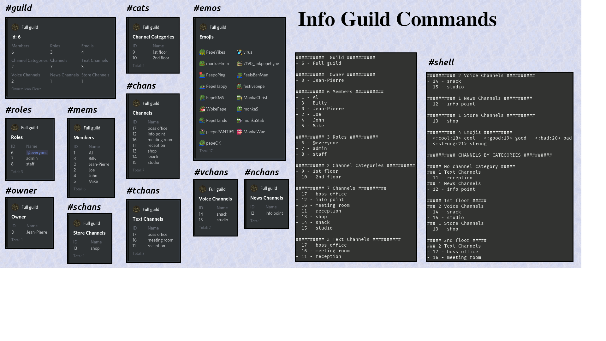

## MyDiscordBotPython
[](https://www.codacy.com/manual/JBthePenguin/MyDiscordBotPython?utm_source=github.com&amp;utm_medium=referral&amp;utm_content=JBthePenguin/MyDiscordBotPython&amp;utm_campaign=Badge_Grade)  [](https://www.gnu.org/licenses/gpl-3.0)

:exclamation::exclamation::exclamation:***IN PROGRESS***:exclamation::exclamation::exclamation:

### Install
[](https://www.python.org/downloads/) 

#### Clone and Virtual environment
```shell
$ git clone https://github.com/JBthePenguin/MyDiscordBotPython.git
$ cd MyDiscordBotPython
$ virtualenv -p python3 env
$ source env/bin/activate
```

#### Requirements and Discord Bot token
-   [discord.py](https://discordpy.readthedocs.io/en/latest/) - [python-dotenv](https://github.com/theskumar/python-dotenv) - [aiounittest](https://github.com/kwarunek/aiounittest) - [tinydb](https://tinydb.readthedocs.io/en/latest/)
```shell
(env)$ pip install -r requirements.txt
```

You need to [create a Discord Bot account to get a token](https://discordpy.readthedocs.io/en/latest/discord.html).
-   create a *.env* file with the token (replace *HereYourToken* with yours)
```shell
(env)$ echo "DISCORD_TOKEN=HereYourToken" > .env
```

### Run
-   Full bot
```shell
(env)$ python my_bot
```
-   Info Team bot
```shell
(env)$ python my_bot --info
# or
(env)$ python my_bot -i
```
-   Event bot
```shell
(env)$ python my_bot --event
# or
(env)$ python my_bot -e
```

### Tests
[](https://travis-ci.com/github/JBthePenguin/MyDiscordBotPython)
-   All tests
```shell
(env)$ python -m unittest -v
# or
(env)$ python run_test.py -v
```
-   Test for a specific module (ex: info)
```shell
(env)$ python -m unittest -v my_bot.info.test
```
-   Test for a specific TestCase (ex: InfoGuildCommandsTest)
```shell
(env)$ python -m unittest -v my_bot.info.test.InfoGuildCommandsTest
```
-   Only one specific test (ex: test_members)
```shell
(env)$ python -m unittest -v my_bot.info.test.InfoGuildCommandsTest.test_members
```

### Screenshots

